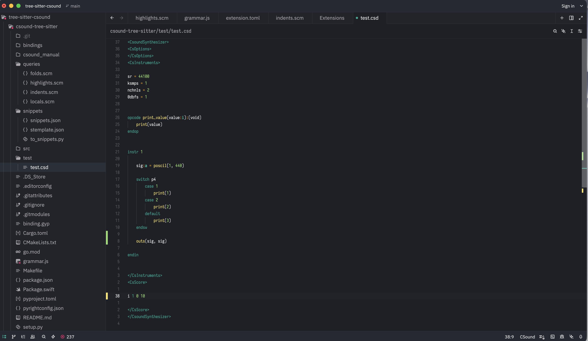
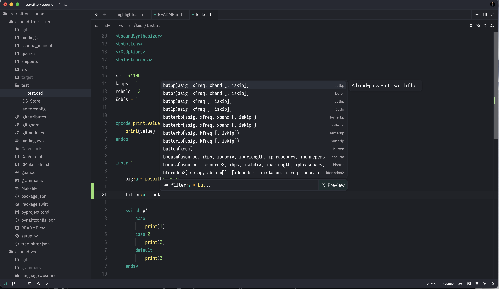
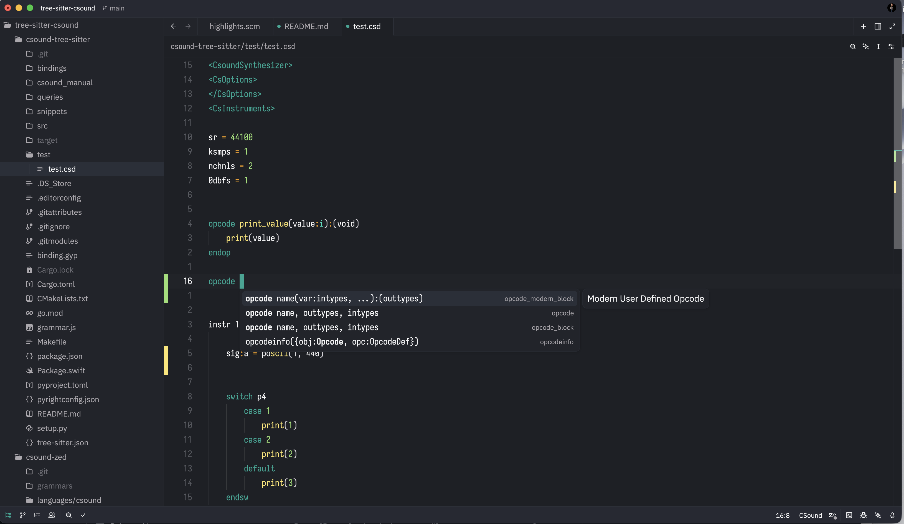

# Csound grammar for the tree-sitter parser

This grammar can be used to provide syntax highlighting, indentation, and parsing support in editors that use Tree-sitter for [CSound 7](https://github.com/csound/csound) .

---

## Features

- Syntax highlighting for:
  - Orchestra statements
  - Score statements
  - Macros and preprocessor directives
- Parsing support for:
  - Instruments (`instr ... endin`)
  - Opcodes and UDOs (`opcode ... endop`)
  - Structs
  - Control statements (`if`, `while`, `for`, `switch`, etc.)
- Block recognition for Csound document structure (`<CsOptions>`, `<CsInstruments>`, `<CsScore>`)
- Indentation rules for nested blocks
- Local variable recognition for autocompletion

---

## Snippets / Autocomplete

This extension includes automatically generated **completion** for opcodes and instructions.  
The snippets are generated by parsing the [**official CSound manual**](https://github.com/csound/manual).  

The completion reference file `csound.json` located in tree-sitter submodule `tree-sitter-csound/snippets/` folder depends on offcial csound manual repo. To update completion reference, in the same folder run:

```bash
python to_snippets.py
```



  


